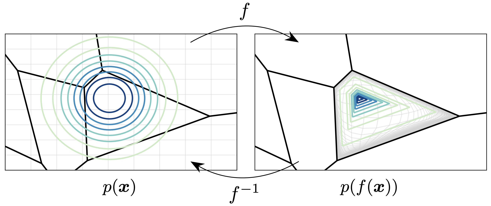
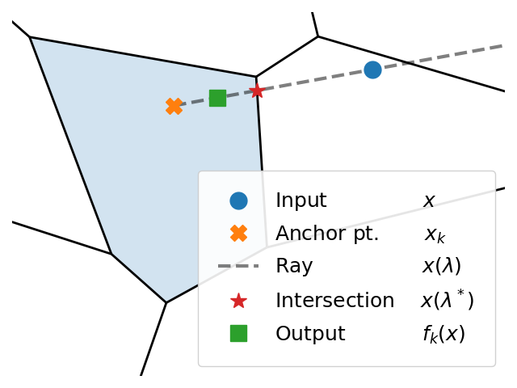

# Semi-Discrete Normalizing Flows through Differentiable Tessellation

This is code for the NeurIPS 2022 paper https://arxiv.org/abs/2203.06832.

<p align="center">

</p>

## Bijective transformation onto the Voronoi cell

This scripts provides some examples of using the Voronoi tessellation and bijective transformation used in the paper.
```
python test_voronoi.py
```
This creates the following figure, among other visualizations.

<p align="center">

</p>

## Data

Scripts to download the discrete UCI and itemset datasets are provided.

```
cd data
python download_itemsets.py
python download_uci.py
```

Download the continuous UCI data from https://github.com/gpapamak/maf#how-to-get-the-datasets and place them in the `data/` directory.

## Experiments

Discrete 2D:
```
python train_discrete2d.py -m dataset=cluster3,cluster10,discrete_8gaussians embedding_dim=2,4,8 seed=0,1,2
```

UCI Categorical:
```
python train_uci.py -m dequantization=voronoi dataset=mushroom,nursery,connect4,uscensus90,pokerhand,forests num_transformer_layers=2,3 num_flows=4,8 embedding_dim=2,4,6 share_embeddings=True,False base=gaussian,resampled
```

Character-level Language Modeling:

Install the `survae` dependency
```
pip install git+https://github.com/didriknielsen/survae_flows
```

```
python train_charlm.py -m dequantization=voronoi dataset=text8,enwik8 model=ar embedding_dim=5,8,12
```

## Citations
If you find this repository helpful for your publications,
please consider citing our paper:

```
@inproceedings{
    chen2022semidiscrete,
    title={Semi-Discrete Normalizing Flows through Differentiable Tessellation},
    author={Ricky T. Q. Chen and Brandon Amos and Maximilian Nickel},
    booktitle={Advances in Neural Information Processing Systems},
    year={2022},
}
```

## License
This repository is licensed under the
[CC BY-NC 4.0 License](https://creativecommons.org/licenses/by-nc/4.0/).